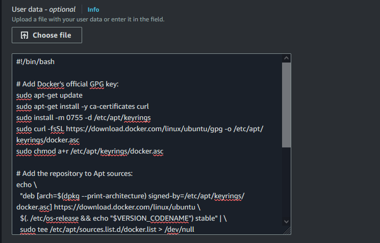

# ContainerizedDotnetBenchmarks
I created this project to make running [BenchmarkDotnet](https://benchmarkdotnet.org/) benchmarks on the cloud easier and less manual.

## Contents
This repository contains 2 projects [ContainerizedDotnetBenchmarks (the client)](ContainerizedDotnetBenchmarks) and [ContainerizedDotnetBenchmarks.Server (the server)](ContainerizedDotnetBenchmarks.Server).

> [!NOTE]
> The two projects are in the same solution, but they don't have any code dependencies on each other. 
> I put them in the same solution so i don't have to deal with multiple solutions.
> 
> The two projects do still depend on each other tough.

## How To Use

### The Client

#### Build
First you will need one or more BenchmarkDotnet benchmark projects. All of them need to share one parent directory which optimally shouldn't be `/` or `C:\`. (=^ω^=)\
After that you need to build the docker image. The dockerfile takes the following arguments:

* **BUILD_CONFIGURATION**\
  This argument controls the build configuration of the benchmark runner project. BenchmarkDotnet benchmarks are always built in release mode.
* **BenchmarkProjectsParentDirectoryPath**\
  This is the parent directory which contains all your benchmark projects. It will be copied into the docker image.
* **BenchmarkProjectProjectFilePaths**\
  The file paths to the project files for your benchmarks seperated by semicolons and relative to the directory specified in BenchmarkProjectsParentDirectoryPath.
* **TFMsForBenchmarkProjects**\
  The frameworks formatted as [TFMs](https://github.com/dotnet/docs/blob/main/docs/standard/frameworks.md) to run your benchmark projects with. 
  These are also seperated by semicolons. The first in this list is used for the first project in BenchmarkProjectProjectFilePaths and so on.

#### Run
When running the container your have the following environment variables:

* **BenchmarkProjectProjectFilePaths**\
  With this you can override the previously set benchmark projects to run.
* **TFMsForBenchmarkProjects**\
  With this you can override the previously set frameworks to run your benchmark projects with.
* **InstanceName**\
  With this you can name your instance. This name is displayed on the server and used in the path under which the benchmark results will be saved. (That means it needs to be a valid folder name on the platform the server is running on.) 
  This is especially useful when you have multiple instances.
* **ServerAddress**\
  This is the URI to your server.
* **ServerPassword**\
  This is the password which is used to authenticate with your server.

#### AWS EC2 example
I will take AWS as an example here, but you can use any cloud provider you want. 
If you use Google cloud you can actually select a docker image to auto run on your VM instance.

First push your docker image to some container repository like docker hub. So you can then easily pull it down to your EC2 instances.

This is an example script for an Ubuntu [AMI](https://docs.aws.amazon.com/AWSEC2/latest/UserGuide/AMIs.html).
```shell
#!/bin/bash

# Add Docker's official GPG key:
sudo apt-get update
sudo apt-get install -y ca-certificates curl
sudo install -m 0755 -d /etc/apt/keyrings
sudo curl -fsSL https://download.docker.com/linux/ubuntu/gpg -o /etc/apt/keyrings/docker.asc
sudo chmod a+r /etc/apt/keyrings/docker.asc

# Add the repository to Apt sources:
echo \
  "deb [arch=$(dpkg --print-architecture) signed-by=/etc/apt/keyrings/docker.asc] https://download.docker.com/linux/ubuntu \
  $(. /etc/os-release && echo "$VERSION_CODENAME") stable" | \
  sudo tee /etc/apt/sources.list.d/docker.list > /dev/null
sudo apt-get update

sudo apt-get install -y docker-ce docker-ce-cli containerd.io docker-buildx-plugin docker-compose-plugin

sudo docker pull YourDockerHubUserName/YourDockerRepository:YourTag

sudo docker run -d -e ServerAddress='https://example.com:6969' -e InstanceName='NameToIdentifyThisInstance' --name containerized_dotnet_benchmarks YourDockerHubUserName/YourDockerRepository:YourTag
```

To make this script run at startup past it into the [User data](https://docs.aws.amazon.com/AWSEC2/latest/UserGuide/user-data.html?icmpid=docs_ec2_console) field.



Now you can deploy your EC2 instance and your benchmarks should run.

### The Server
There are 3 extra settings in the appsettings:
* **AuthenticationConfig.Password**\
  Sets the password for the server. If not set the password will be "password12345".
* **useSpectreConsole**\
  This is a boolean which sets the console output. 
  If enabled [Spectre.Console progress bars](https://spectreconsole.net/live/progress) will be displayed on the console instead of the regular logs.
  Specifically, it sets the minimum log level for the console to error instead of info, except for Microsoft.Hosting.Lifetime logs, so that the startup info is still displayed.
* **useDesktopNotifications**\
  This is a boolean which sets whether to create desktop notifications upon receiving benchmark results.

The server has the following endpoints:

* **GET /ping**\
  This endpoint is for testing if your server is reachable. It is not used by the client. It is just there to make your life a bit easier.
* **POST /status**\
  This endpoint is used to send status updates on the progress of the currently running benchmark.
  These updates are printed to the console. 
* **POST /result**\
  This endpoint is used to receive the benchmarking results. This is also printed to the console.

When a benchmark is finished the client will zip the `BenchmarkDotNet.Artifacts` directory and send it to the /result endpoint.
The server will then save it under `BenchmarkResults/[INSTANCE_NAME]/[BENCHMARK_PROJECT_NAME]/yyyy-mm-dd/BenchmarkResults.zip`.
